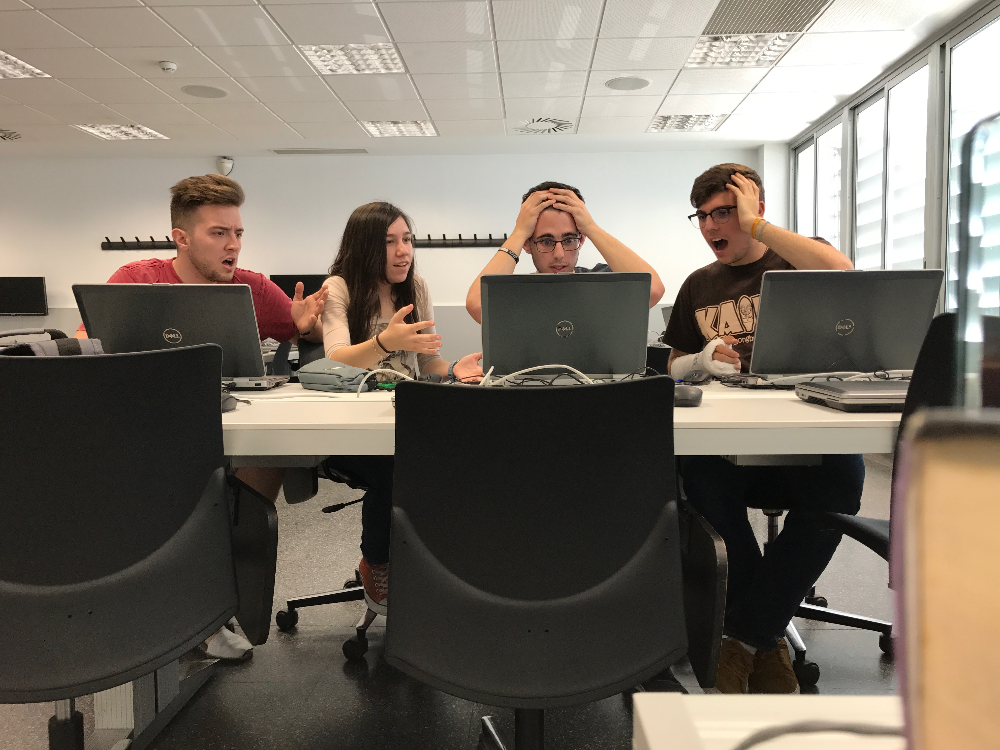

## **Our project** 

Project for Videogame Development subject. The main goal here is to create a simple plattaformer with two levels done in Tiled, having a main character moving around while being able to save and load game’s state. On top of this enemies pathfinding is implemented along other stuff such as stable frame rate (30fps), normalized movement, structured entity system described in an UML file and code with Brofiler integration.

This project has been done by two catalan students of CITM - UPC (Terrasa, Spain).

## **About the game**

Simple platformer with a temple-type theme featuring a yellow character. Equipped with a gun, he will have to reach the end of the level avoiding obstacles and killing enemies.

## **Our Team**

_García Subirana, Guillermo's responsability and Github account_

* Code
* [Github account](https://github.com/Wilhelman)

_Masó Garcia, Víctor's responsability and Github account_

* Management
* [Github account](https://github.com/nintervik)

## **Main core system of the game**

### Innovations
* Player and enemy animations are read from an xml file.
* Spawn enemy points are created with Tiled and read from the tmx file of the map.

## **Tools used**
* IDE: Microsoft Visual Studio 2017
* Language: C++
* Graphics and audio: SDL 2.0
* Data: pugixml 1.8
* Level editor: Tiled 0.17
* Profiler: Brofiler
* Code repository: GitHub
* Others: Adobe Photoshop CS6, MS Paint and Aseprite

## **Gameplay**

<iframe width="740" height="590" src="https://www.youtube.com/embed/yBFzOEv0snY" frameborder="0" allowfullscreen></iframe>

## **Installation instructions**

Download the zip file and unzip it. Open the folder, execute the .exe and enjoy!

_IMPORTANT: do not modify, change or add any folder or file as you might not be able to execute the game._

## **How to play**

score system, timer...

# Controls
~~~~~~~~~~~~~~~

Player controls:
- JUMP: W key (twice for double jump)
- LEFT: A key
- RIGHT: D key
- SHOOT: SPACE key (hold for continuous shooting)

General/developer controls:
- PUASE GAME: ESC key
- START FROM THE VERY FIRST LEVEL: F1 key
- START FROM THE BEGGINING OF THE CURRENT LEVEL: F2 key
- SHOW COLLIDERS: F3
- SAVE GAME (player position and current level):  F5 key
- LOAD GAME (player position and level saved): F6 key
- UI DEBUG MODE: F8
- GOD MODE: F10
- CAP FRAMERATE: F11
- MUSIC VOLUME: +/- keys

~~~~~~~~~~~~~~~

## **Credits for artwork, music/sound fx and fonts**

~~~~~~~~~~~~~~~

Sprites:

* Artwork created by Luis Zuno (@ansimuz). Sprites can be found [here](https://ansimuz.itch.io/grotto-escape-game-art-pack)
* Artwork created by [Henry Sofware](https://henrysoftware.itch.io/). Sprites can be found [here](https://henrysoftware.itch.io/free-pixel-mob)
* UI artwork created by [Kenny](http://www.kenney.nl/). Sprites can be found [here](https://opengameart.org/content/ui-pack-rpg-extension)

Tileset:

* Artwork created by Luis Zuno (@ansimuz). Tileset can be found [here](https://ansimuz.itch.io/grotto-escape-ii-art-pack-)

Music:

* Game music from [DL SOUNDS](https://www.dl-sounds.com/). It can be found [here](https://www.dl-sounds.com/royalty-free/arcade-funk/)
* Main menu music from [DL SOUNDS](https://www.dl-sounds.com/). It can be found [here](https://www.dl-sounds.com/royalty-free/8-bit-detective/)

Sound FX:

* Player shot and jump sound fx can be found [here](https://ansimuz.itch.io/grotto-escape-game-art-pack)
* This game uses these sounds from freesound:
      
	- 249616__vincentm400__function-fail.wav by [OwlStorm / Natalie Kirk](https://freesound.org/people/OwlStorm/)
	
Fonts:
* Fonts can be found here: 

~~~~~~~~~~~~~~~

### *Download the last version of the game [HERE]()*
### *Check our Github repository [HERE](https://github.com/nintervik/Temple-Escape)*

## **Liscense**

~~~~~~~~~~~~~~~

MIT License

Copyright (c) 2017 

Permission is hereby granted, free of charge, to any person obtaining a copy
of this software and associated documentation files (the "Software"), to deal
in the Software without restriction, including without limitation the rights
to use, copy, modify, merge, publish, distribute, sublicense, and/or sell
copies of the Software, and to permit persons to whom the Software is
furnished to do so, subject to the following conditions:

The above copyright notice and this permission notice shall be included in all
copies or substantial portions of the Software.

THE SOFTWARE IS PROVIDED "AS IS", WITHOUT WARRANTY OF ANY KIND, EXPRESS OR
IMPLIED, INCLUDING BUT NOT LIMITED TO THE WARRANTIES OF MERCHANTABILITY,
FITNESS FOR A PARTICULAR PURPOSE AND NONINFRINGEMENT. IN NO EVENT SHALL THE
AUTHORS OR COPYRIGHT HOLDERS BE LIABLE FOR ANY CLAIM, DAMAGES OR OTHER
LIABILITY, WHETHER IN AN ACTION OF CONTRACT, TORT OR OTHERWISE, ARISING FROM,
OUT OF OR IN CONNECTION WITH THE SOFTWARE OR THE USE OR OTHER DEALINGS IN THE
SOFTWARE.

~~~~~~~~~~~~~~~
